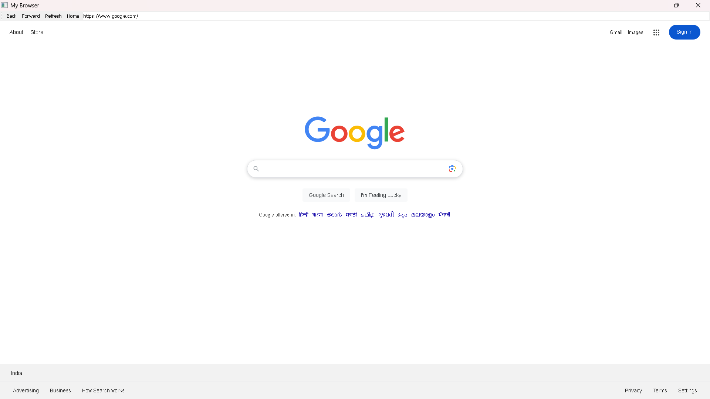

# 🔗 PyQt5 Web Browser

A simple, lightweight web browser built using Python and PyQt5. This project demonstrates how to create a basic GUI browser using `QWebEngineView`, with support for essential browsing functions like back, forward, refresh, and a URL bar.

---

## 📸 Screenshots




---

## 🚀 Features

- 🏠 Homepage set to Google
- 🔙 Back, 🔜 Forward, 🔄 Refresh buttons
- 🌐 URL bar with real-time page tracking
- 🔢 Auto-adds `http://` if missing from URL
- 🧭 Navigation using toolbar
- 📈 Clean and minimal GUI with full-screen mode

---

## 🛠️ Getting Started

### 🔧 Requirements

Make sure you have Python 3.6+ installed.

Install the required dependencies:

```bash
pip install PyQt5 PyQtWebEngine
